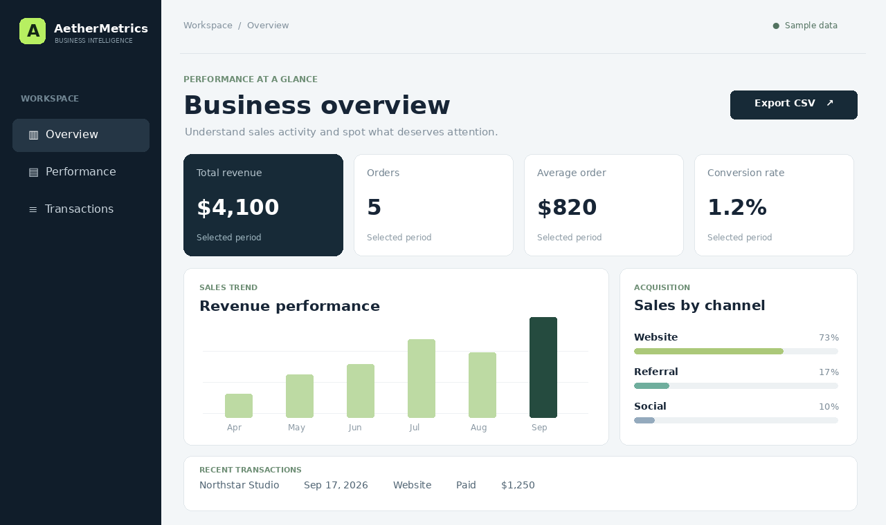

# AetherMetrics

An interactive business analytics dashboard by Muhammad Numan / MN Solution.

The preview is an illustrative rendering of the dashboard layout. Open the app for the interactive view.

## What it demonstrates

- Revenue, paid orders, average order value and visit-to-order conversion
- Revenue trend and channel mix based on actual transaction records
- 30-day, 90-day and all-time reporting filters
- Searchable transaction list and CSV export
- Responsive layout with accessible labels and keyboard focus states

This is a **portfolio demo with fictional sample transactions**, not a live client deployment. There are no external dependencies, sign-in, tracking, or network requests. Open `index.html` in a browser to use it. The reference date is September 22, 2026 for reproducible sample-period views.

## Implementation

Plain HTML, CSS and JavaScript. Metrics and chart values are calculated from one local sample dataset in `app.js`; the CSV export uses the active period. This demo is intentionally self-contained and does not claim a production database or AI integration.

## Next production steps

Add authenticated users and organizations, secure API endpoints, a relational database, source integrations, and permission-aware reporting when adapting this design to a real business.

**Contact:** [LinkedIn](https://www.linkedin.com/in/muhammad-numan-8656b1406/) · [GitHub](https://github.com/M-Numan12)
